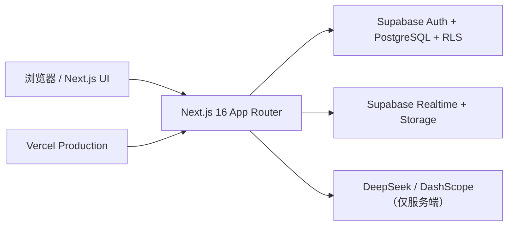

# Campus Connect

[](https://campus-connect-six-rho.vercel.app)
[](https://github.com/mayiwei442-bojack/campus-connect/actions/workflows/quality.yml)


Campus Connect 是一个面向校园场景的社交与协作 Web 应用。用户可以先表达“今天想一起做什么”，再通过校园地点、活动、Skill、Persona 和实时聊天找到合适的人并真正开始行动。

> **公开版本：** [https://campus-connect-six-rho.vercel.app](https://campus-connect-six-rho.vercel.app)
> **生产源码：** GitHub 默认分支 `main`。Vercel 生产部署与 `main` 使用同一份源码，不包含本地环境文件、个人 3D 模型或未合并实验功能。

## 项目亮点

- **意图驱动的校园连接**：从自然语言需求出发，解析活动、时间、人数、地点和 Skill 偏好。
- **3D 校园地图**：加载静态校园 GLB，使用稳定的 `PLACE_*` / `ANCHOR_*` 节点展示地点与动态 Activity Beacon。
- **完整活动流程**：支持自由加入、审核加入、人数上限、候补队列、退出留痕和活动会话归档。
- **实时聊天与好友关系**：使用 Supabase Realtime，同步文本、图片、活动群聊和好友私聊。
- **Skill 与 Persona**：在用户授权范围内展示技能、兴趣与 Persona 知识；缺少依据时不会让 AI 编造回答。
- **隐私与权限**：核心表启用 RLS，服务端密钥不进入浏览器，匹配逻辑尊重可见性、联系开关和屏蔽关系。
- **可复现质量门禁**：包含 TypeScript、ESLint、Vitest、数据库测试和 Playwright 黄金路径测试。

## 当前功能

| 模块 | 能力 |
| --- | --- |
| 账号 | 邮箱注册、确认、登录、退出、受保护路由 |
| 首页 / Connect | 意图输入、结构化解析、确定性筛选、推荐解释与活动邀请 |
| 校园地图 | GLB 场景、地点搜索、Place / Anchor 解析、活动 Beacon 聚合 |
| 活动 | 创建、加入/审核、容量、候补、离开、结束与历史保留 |
| 消息 | 活动群聊、好友搜索与申请、私聊、文本/图片、历史与 Realtime |
| Profile / Skill | 资料编辑、公开控制、Skill 管理、资料卡背景 |
| Persona | 最多 3 个 Persona、文字/图片知识、待确认草稿、公开问答 |
| 通知 / 管理 | 已有基础页面与权限边界，仍在继续完善产品流程 |

## 技术架构



- 前端：Next.js 16、React 19、TypeScript、Tailwind CSS 4、React Three Fiber / Three.js
- 后端：Supabase Auth、PostgreSQL、RLS、Realtime、Storage
- AI：DeepSeek 负责意图/文本能力，DashScope 负责已授权图片的分析；密钥仅在服务端使用
- 部署：Vercel；`main` 是唯一生产源码分支

## 在线版与本地版

| 环境 | 地址 | 数据与用途 |
| --- | --- | --- |
| Vercel 生产版 | [campus-connect-six-rho.vercel.app](https://campus-connect-six-rho.vercel.app) | 面向其他用户，使用生产环境变量与托管 Supabase |
| 本地开发版 | [http://localhost:3000](http://localhost:3000) | 仅当前电脑可访问，使用 `.env.local`；适合开发和调试 |

两者的界面源码都来自最新 `main`。差异只应来自运行环境、域名和数据源，不应来自未推送的本地代码。

## 本地运行

### 1. 环境要求

- Node.js `>= 20.9`（推荐 Node.js 24）
- pnpm 11
- 可选：Docker Desktop，用于本地 Supabase 与端到端测试

### 2. 安装与配置

```bash
git clone https://github.com/mayiwei442-bojack/campus-connect.git
cd campus-connect
corepack enable
pnpm install
```

复制环境变量模板：

```powershell
Copy-Item .env.example .env.local
```

macOS / Linux：

```bash
cp .env.example .env.local
```

至少配置以下变量：

| 变量 | 是否必需 | 说明 |
| --- | --- | --- |
| `NEXT_PUBLIC_SITE_URL` | 是 | 本地使用 `http://localhost:3000`，生产使用实际 Vercel 域名 |
| `NEXT_PUBLIC_SUPABASE_URL` | 是 | Supabase Project URL |
| `NEXT_PUBLIC_SUPABASE_PUBLISHABLE_KEY` | 是 | 浏览器可用的 publishable key，不是 secret/service-role key |
| `DEEPSEEK_API_KEY` | AI 功能需要 | 仅服务端读取 |
| `DEEPSEEK_MODEL` | 否 | 未设置时使用代码内默认值 |
| `DASHSCOPE_API_KEY` | 图片分析需要 | 仅服务端读取 |
| `DASHSCOPE_WORKSPACE_ID` | 视账号配置 | DashScope workspace |
| `DASHSCOPE_MODEL` | 否 | 未设置时使用代码内默认值 |

### 3. 启动

```bash
pnpm dev
```

打开 [http://localhost:3000](http://localhost:3000)。

## 数据库与演示数据

应用按时间顺序使用 `supabase/migrations/` 中的迁移；不要只创建空 Supabase 项目后直接启动前端。

```bash
pnpm exec supabase login
pnpm exec supabase link --project-ref <project-ref>
pnpm exec supabase db push --dry-run
pnpm exec supabase db push
```

本地完整环境：

```bash
pnpm supabase:start
pnpm supabase:reset
pnpm supabase:lint
```

`supabase/seed.sql` 只用于本地/演示环境，包含可复现的虚拟学生、Skill、Persona、活动和聊天数据，**不要导入真实生产项目**。详情见 [`docs/DEMO_SEED.md`](docs/DEMO_SEED.md)。

## 质量检查

```bash
pnpm typecheck
pnpm lint
pnpm test
pnpm build
```

完整本地黄金路径测试需要 Docker Desktop 和 Chromium：

```bash
pnpm exec playwright install chromium
pnpm supabase:start
pnpm supabase:reset
pnpm test:e2e
pnpm supabase:stop
```

GitHub Actions 会对 `dev` / `main` 的相关变更运行应用检查、Supabase 迁移检查，以及黄金路径 A（活动）与 B（AI 匹配）浏览器测试。

## 部署到自己的 Vercel

[](https://vercel.com/new/clone?repository-url=https%3A%2F%2Fgithub.com%2Fmayiwei442-bojack%2Fcampus-connect&env=NEXT_PUBLIC_SITE_URL,NEXT_PUBLIC_SUPABASE_URL,NEXT_PUBLIC_SUPABASE_PUBLISHABLE_KEY,DEEPSEEK_API_KEY,DASHSCOPE_API_KEY,DASHSCOPE_WORKSPACE_ID)

1. Fork 或克隆仓库，并确认部署分支为 `main`。
2. 创建自己的 Supabase 项目，先应用 `supabase/migrations/`。
3. 在 Vercel 配置上表中的环境变量；不要提交 `.env.local`。
4. 将 `NEXT_PUBLIC_SITE_URL` 设为自己的生产域名。
5. 在 Supabase Auth URL Configuration 中加入 `https://<your-domain>/auth/confirm`。
6. 部署后验证注册、邮箱确认、登录、地图、活动、消息和 Persona 路径。

更详细的控制台配置见 [`docs/SUPABASE_AND_VERCEL_SETUP.md`](docs/SUPABASE_AND_VERCEL_SETUP.md)。

## 分支与发布规则

- `main`：稳定、可公开部署的生产源码
- `dev`：已验收功能的集成分支
- `codex/*` / `feature/*`：隔离开发分支，必须通过检查后再合并

个人素材、3D 小人、自定义 GLB 头像实验、本地 `.env.local`、`.vercel/`、测试报告和构建缓存都不属于公开生产版本。

## 设计与安全约束

- `Activity` 是业务实体，Beacon 只是地图上的动态表现，不创建重复 Beacon 业务表。
- MVP 不使用真实 GPS；用户通过校园 Place 表达位置。
- AI 只能使用用户授权的可见数据，不读取私人聊天进行匹配。
- 敏感密钥只在服务端；浏览器仅使用 Supabase publishable key。
- 图片存入私有 Storage，数据库保存路径和元数据；核心访问由 RLS/服务端校验约束。
- AI 或 3D 场景失败时，其他模块仍应独立可用。

完整产品规则与验收标准见 [`PROJECT_SPEC.md`](PROJECT_SPEC.md)，协作开发规则见 [`AGENTS.md`](AGENTS.md)。
